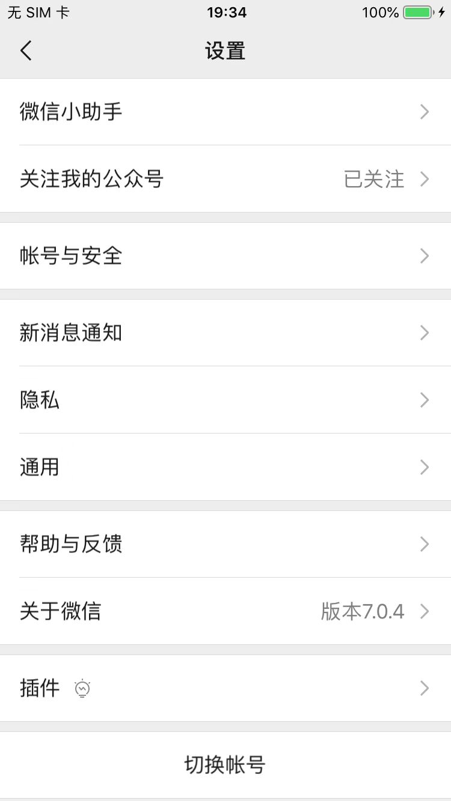
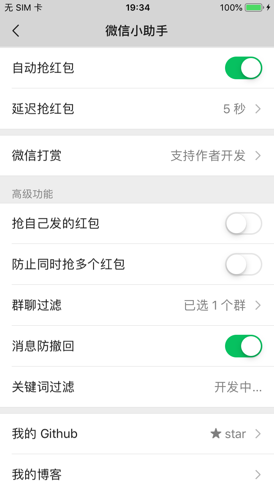
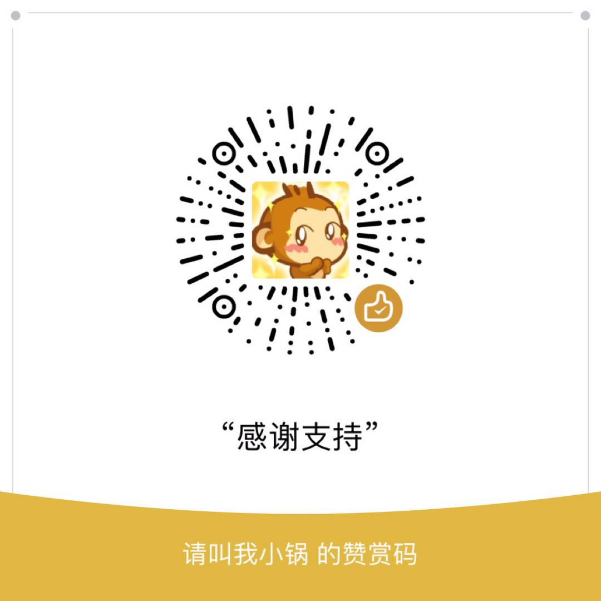

# iOS版微信抢红包插件

目前市面上最稳定、功能最全的 iOS 版微信抢红包插件。

```
2019-07-03 已更新，支持最新版微信。
```

## 功能特色

- **完全原生体验**

    完美嵌入微信设置中，无需安装其它无关应用。开启插件后，所有抢红包工作都会默默进行，不会影响微信的正常使用流程。

- **可自由设置延迟抢红包时间**

    有效防止抢红包速度太快而被拉黑或者踢出群聊。

- **可设置防止同时抢多个红包**

    最大程度避免被系统检测出使用插件，红包抢得更安心。

- **可设置过滤特定的群聊**

    防止落入公司群或者点餐群抢红包的尴尬境地。

- **更新速度快**
 
    紧跟微信更新，社区活跃，失效后第一时间进行修复。

- **安全、值得信赖**

    源码完全公开透明，Cydia 市场超过万次下载，值得你拥有

## 安装方法

- 越狱手机
    1. cydia 市场：直接在 cydia 市场搜索 `WeChatRedEnvelop`，下载安装即可
    2. 手动编译安装：参考 [iOS微信抢红包Tweak安装教程](http://www.swiftyper.com/2016/01/25/ios-tweak-install-guide/) 教程
- 非越狱手机：参考 [免越狱版 iOS 抢红包插件](http://www.swiftyper.com/2016/12/26/wechat-redenvelop-tweak-for-non-jailbroken-iphone/) 教程

## 更新日志

完整的更新日志请参考[CHANGELOG](./CHANGELOG.md)。

## 版权及免责声明

本插件是由本人学习[iOS应用逆向工程](https://www.amazon.cn/gp/product/B00VFDVY7E/ref=as_li_tf_tl?ie=UTF8&camp=536&creative=3200&creativeASIN=B00VFDVY7E&linkCode=as2&tag=buginux-23)后并由[该书作者](https://github.com/iosre)进行指导后开发的，所有代码都由本人完成。

外挂有风险，使用需谨慎。

要使用本插件，请使用者自行承担各种状况，包括但不限于“禁用红包功能”以及“微信封号”。

## 应用截图




## 支持作者

本项目的所有逆向分析工作，代码编写工作都由本人一人完成。

插件的开发占用了我大量的时间和精力，如果你觉得这个插件对你有帮助（帮你抢到了比之前更多的红包），不妨进行一下小额捐赠，这样我会有更大的动力去完善、优化它。




**现已支持信用卡赞赏！**


