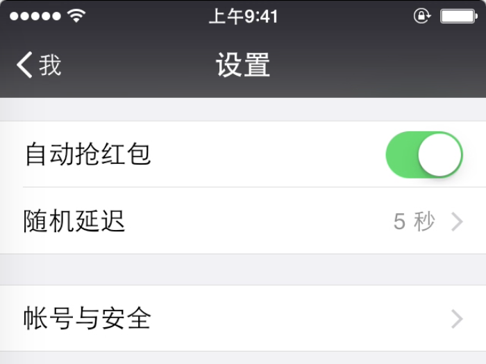

# iOS版微信抢红包插件Tweak

这个插件是我学习[iOS应用逆向工程](https://www.amazon.cn/gp/product/B00VFDVY7E/ref=as_li_tf_tl?ie=UTF8&camp=536&creative=3200&creativeASIN=B00VFDVY7E&linkCode=as2&tag=buginux-23)后做的一个练手的小插件。

只要你的手机已经越狱，并且安装了这个 Tweak，登录你的微信后就可以自动抢红包，不需要任何的手动操作。

**本插件只用于学习目的，请勿使用于别的用途**

更多内容请访问[我的博客](http://www.swiftyper.com)。

## 声明

由于本插件最近一段时间传播速度较快，导致微信做了反外挂检测，再加上这个 Tweak 的代码已经开源，所以他们要做处理简直易如反掌。实际上，去年本插件没有大幅度传播之前，我使用了一年都相安无事。这个插件本来只是做为逆向学习的练手项目，既然最近引起了大家的关注，我也会再投入一部分精力来维护这个插件，在被封之后尽快找到解决方案。

大家都应该都知道做逆向的难度，可能微信那边只加了几句代码做反外挂，逆向这边就得花几天时间找到相关更新的代码，然后再考虑如何绕过检测机制。因此，如果本插件如果失效是很正常的事情，请不要慌，逆向的东西从来就不是一劳永逸的。

Don't Panic。

只需要耐心等待更新就行了，只要在我的精力和能力允许范围内，我就会以最快的速度更新的。

## 最新战斗播报

* 2017-01-22 修复微信 6.5.3 版本检测强制下线问题
  * 此版本代码使用了模拟网络请求功能，稳定性还未经过测试，如有问题请提 issue
  
## 注入版本

太多人跟我要注入完成后的版本了，实在没办法一个一个回，我就直接在这里给出下载地址吧。

* 微信 6.5.4 版本：链接: https://pan.baidu.com/s/1boAwMHh 密码: 4iut
 
## 更新

### 免越狱版本 FAQ

安装免越狱版本可能出现的情况比较多，我会尽量收集到这里来，如果碰到问题请先查阅这里，再到 issue 里面看有没有类似的问题。最近发现很多人都一直在问重复的问题，其实在 issue 里面已经都回答过了。本人精力有限，不能每次都回答重复的问题，希望以后有问题自己先查阅下相关资料再到 issue 搜索下，基本上都能解决。

> Q: 能不能提供注入后的微信 ipa ？

> A: 这个我之前发过几次，但是我还是建议最好自己动手做一遍。如果实在懒不想动手，那就 issue 搜索，我已经提供过了，之后再来要，我就不回复了。

> Q: Tweak 下载下来后执行 make 报错？

> A: 这种情况一般都是你越狱开发环境没安装好，请[参考这篇文章](http://www.swiftyper.com/2016/01/25/ios-tweak-install-guide/)，先安装好环境，类似问题不再回复。

> Q: 安装后没效果，或者闪退？

> A: 首先，这个插件的抢红包只对群红包有效，如果是私聊是不会抢的，这点请明确。其次，请确认是否在设置里面打开了开关，如果是进设置闪退的话，一般就是因为微信版本过低，代码有变动的缘故。再者，如果是进入微信后就闪退，这种情况就是你没有注入成功了，请对着教程再做一遍，确保每一步都是跟教程上一致的。

> Q: optool 编译不成功？

> A: 这个工具依赖得比较复杂，所以需要确认所有的依赖库都下载下来了。如果还是碰到问题，这种可以直接 Google 的，编译问题我这边没有办法帮你解决。

> Q: 微信检测出使用抢红包插件，强制下线？

> ~~A: 临近春节了，微信加强了对插件的检测，因此可能会被强制下线。最近比较忙，还没有时间去研究它的检测机制，不确认是服务端检测还是客户端检测。如果是客户端检测的话，可以使用稍微旧一点的版本，那里应该没有检测机制。如果是其它的检测机制，这就需要花时间再研究下，只要有发现我就会及时来更新代码的，请耐心等候。~~

> A: 请查看前面的**声明**小节。

### 关于免越狱版本

现在已更新免越狱版本，具体内容请见：[免越狱版 iOS 抢红包插件](http://www.swiftyper.com/2016/12/26/wechat-redenvelop-tweak-for-non-jailbroken-iphone)。

### 2016-12-17 更新：

本 tweak 已经上传到 bigboss 源，只要在 Cydia 上搜索 WeChatRedEnvelop 下载安装就可以了。

### 2016-12-14 更新：

虽然已经有打开与关闭功能，但是由于抢红包速度太快，很多小伙伴被怀疑使用了外挂（虽然确实使用了外挂），还是无法逃脱被踢群或者拉黑的命运。

特此更新随机延迟功能，可以手动设置随机延迟的秒数，设置为 0 或者留空为不延迟（用于年会或其它大额红包时，速度才是王道）。

使用方法：“我的” - “设置”

### 2016-12-23 更新：

在新年到来之际，应该有很多小伙伴又开始在各种群里刷红包了。为了防止小伙伴被众友人拉黑，特别更新打开与关闭插件的功能。

### 关于后台运行

许多小伙伴问到了后台运行的问题，要支持后台运行也很简单，直接在 Cydia 搜索 WatchDog 然后下载安装就可以了。

## 安装方法

有很多小伙伴都反应说不知道怎么安装，因此写了一篇博客来说明如何从源码安装 tweak。

[教程地址](http://www.swiftyper.com/2016/01/25/ios-tweak-install-guide/)

如果不想了解安装过程，只是想使用的话，可以直接上 Cydia 搜索 WeChatRedEnvelop 下载安装即可。

## 反馈

如果碰到装上没有效果，或者程序闪退情况，可以直接提 issue 并说明设备版本，系统版本以及微信的版本，我会尽快着手修复的。

## 特别感谢

[狗神](https://github.com/iosre)，即 [iOS应用逆向工程](https://www.amazon.cn/gp/product/B00VFDVY7E/ref=as_li_tf_tl?ie=UTF8&camp=536&creative=3200&creativeASIN=B00VFDVY7E&linkCode=as2&tag=buginux-23)的作者。

有了狗神的亲手指导，我才得以能快速完成这个 Tweak 的开发，感谢！

