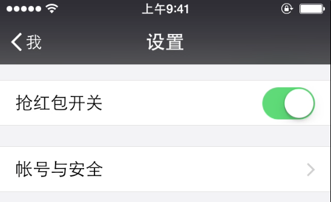

# iOS版微信抢红包插件Tweak

这个插件是我学习[iOS应用逆向工程](http://www.amazon.cn/iOS%E5%BA%94%E7%94%A8%E9%80%86%E5%90%91%E5%B7%A5%E7%A8%8B-%E6%B2%99%E6%A2%93%E7%A4%BE/dp/B00VFDVY7E/ref=sr_1_1?ie=UTF8&qid=1453170509&sr=8-1&keywords=ios%E9%80%86%E5%90%91%E5%B7%A5%E7%A8%8B)后做的一个练手的小插件。

只要你的手机已经越狱，并且安装了这个 Tweak，登录你的微信后就可以自动抢红包，不需要任何的手动操作。

**本插件只用于学习目的，请勿使用于别的用途**

## 更新

### 2016-12-23 更新：

在新年到来之际，应该有很多小伙伴又开始在各种群里刷红包了。为了防止小伙伴被众友人拉黑，特别更新打开与关闭插件的功能。

使用方法：“我的” - “设置”

### 关于后台运行

许多小伙伴问到了后台运行的问题，要支持后台运行也很简单，直接在 Cydia 搜索 WatchDog 然后下载安装就可以了。

## 安装方法

有很多小伙伴都反应说不知道怎么安装，因此写了一篇博客来说明如何从源码安装 tweak。

[教程地址](http://www.swiftyper.com/2016/01/25/ios-tweak-install-guide/)

## 反馈

如果碰到装上没有效果，或者程序闪退情况，可以直接提 issue 并说明设备版本，系统版本以及微信的版本，我会尽快着手修复的。

## 特别感谢

[狗神](https://github.com/iosre)，即 [iOS应用逆向工程](http://www.amazon.cn/iOS%E5%BA%94%E7%94%A8%E9%80%86%E5%90%91%E5%B7%A5%E7%A8%8B-%E6%B2%99%E6%A2%93%E7%A4%BE/dp/B00VFDVY7E/ref=sr_1_1?ie=UTF8&qid=1453170509&sr=8-1&keywords=ios%E9%80%86%E5%90%91%E5%B7%A5%E7%A8%8B)的作者。

有了狗神的亲手指导，我才得以能快速完成这个 Tweak 的开发，感谢！

